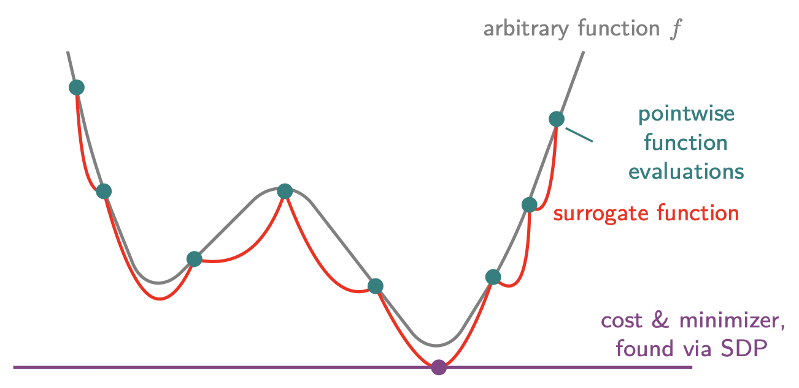

# KernelSOS Toolbox
Implementation of the Kernel Sum-of-Squares optimization framework and various related solvers.

The kernelSOS algorithm solves the following general optimization problem:
```math
\min_{x\in\Omega} f(x)
```
where $f$ is any function that can be sampled over the convex bouded domain $\Omega$. Its generality allows it to be applied to a wide range of problems.

## Usage
The main solver is implemented as `ksos_tools.solvers.ksos.solve`. A minimal example of how to use it is as follows (see `example.py`):

```python
from ksos_tools.solvers import ksos
import numpy as np

# Standard parameters
center = [0.0] # center for sampling
radius = np.pi # radius of sampling
sampling = "linspace" # use a uniform grid for sampling
n_samples = 10 # how many samples to use

# Which solver to use: can be MOSEK, newton (simple log-barrier Newton 
# solver), newton-features or newton-kernel (more advanced solvers using
# feature or kernel matrices, respectively; adding e.g. a linesearch option
# and more advanced diagnostics to the original solver. 
solver = "newton" 

# Which kernel to use: use Gauss for smooth, Laplace for less smooth, 
# or provide a kernel of your choice. 
kernel = "Gauss" 

# Kernel parameter: good to use roughly the minimum distance between
# samples. 
sigma = 2 * np.pi / n_samples 

solution, info = ksos.solve(
    f=np.sin,
    sampling=sampling,
    n_samples=n_samples,
    kernel=kernel,
    center=center,
    radius=radius,
    solver=solver,
    sigma=sigma
)
print(f"Found solution: x={solution[0]:.4f}, f={info['cost']:.4f}")
print(f"True solution:  x={-np.pi/2:.4f}, f=-1")
```

A large variety of options can be passed to the solver, and can be found in the [`ksos.solve`](ksos_tools/solvers/ksos.py) function documentation. Many examples are showcased in the `tests` directory.
